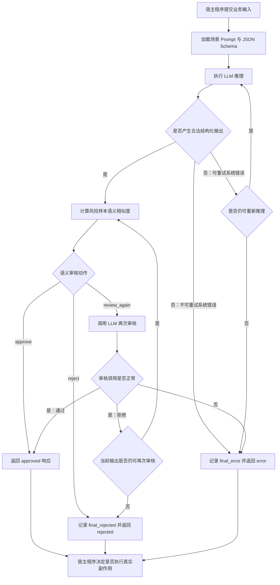

# IntelligentHarness

`IntelligentHarness` 是面向高副作用业务场景的 LLM 输出控制组件。

它位于大模型与宿主程序之间，不直接执行发布、审批、发送或提交等真实业务动作，而是对模型输出进行结构校验、分层语义审核、有界重试、稳定拒绝和业务事件留痕，最终向宿主程序返回 JSON 兼容 KV 结构。

```text
业务输入 -> IntelligentHarness -> 结构化审核结果 -> 宿主程序决定是否执行真实动作
```

## 项目目的

大模型输出具有随机性。Prompt、角色设定和自然语言审核规则只能降低风险，无法形成稳定的硬约束。

在营销文案自动发布、内容安全审核、财务审计、贷款资质判断等场景中，错误输出可能造成合规风险、经济损失或错误决策。此类输出不能在单次模型调用后直接进入外部系统。

本项目解决的问题是：

> 如何在不信任单次 LLM 输出的前提下，为宿主程序提供可配置、可审计、可扩展、能够稳定拒绝不合格输出的控制层？

## 业务价值

`IntelligentHarness` 将大模型从“直接参与业务动作”的不稳定执行者，转化为“输出必须经过控制流程”的候选结果提供者。

它带来的价值包括：

- **降低副作用风险**：审核未通过时不会向宿主程序返回可直接放行的结果。
- **提高结果稳定性**：同一份输出可重复审核，审核持续失败后再重新推理。
- **控制模型调用成本**：审核次数和重新推理次数均有明确上限。
- **支持业务追溯**：每次推理、拦截、最终拒绝和最终系统错误均可形成独立业务事件。
- **降低场景切换成本**：Prompt、Schema 和场景绑定资源外置，运营维护人员无需修改核心代码。
- **保留宿主控制权**：组件只返回结构化结果，真实业务动作始终由宿主程序决定。
- **保持接入灵活性**：通过 ports 协议替换推理服务、Embedding、Reviewer、上下文增强、隐私处理、告警渠道和审计存储。
- **区分日志职责**：架构日志用于定位运行异常；业务事件日志用于审计、告警和宿主订阅，两套机制分别暴露。

## 快速开始

### 1. 安装

项目要求 Python `3.12` 或更高版本。运行 CLI 只需要安装锁定的运行依赖：

```bash
git clone https://github.com/TantiHeng/IntelligentHarness.git
cd IntelligentHarness
python -m venv .venv
```

Windows PowerShell：

```powershell
.\.venv\Scripts\Activate.ps1
python -m pip install --upgrade pip
python -m pip install -r requirements.txt
```

macOS 或 Linux：

```bash
source .venv/bin/activate
python -m pip install --upgrade pip
python -m pip install -r requirements.txt
```

### 2. 先校验本地资源

以下命令不调用真实模型，也不需要 API key。它们用于确认安装成功，并检查本地配置与场景资源：

```bash
python cli.py config-validate
python cli.py scenario-list
python cli.py scenario-validate marketing_copy
```

### 3. 先运行离线拦截验收

没有可用 Embedding 服务时，可以直接使用仓库内置的 Mock 输出和 Mock 向量验证控制链路：

```bash
python cli.py fault-inject --scenario marketing_copy --output fixtures/fault_injection/marketing_copy_rejected.json --mock-embeddings fixtures/fault_injection/marketing_copy_rejected.embeddings.json
```

该命令不调用外部推理模型和外部 Embedding 服务，但会真实执行 CLI 参数解析、场景加载、Schema 校验、风险样本加载、余弦相似度计算、LangGraph 路由、SQLite 审计写入和 KV JSON 输出。

预期关键结果：

```json
{
  "decision": "rejected",
  "approved": false,
  "review": {
    "score": 100,
    "action": "reject",
    "metadata": {
      "risk_intent": "guaranteed_return",
      "cosine_similarity": 1.0
    }
  }
}
```

故障注入参数：

| 参数 | 含义 |
|---|---|
| `fault-inject` | 启动故障注入模式，跳过正常文案生成 |
| `--scenario marketing_copy` | 加载营销文案场景的 Schema、风险样本和审核策略 |
| `--output <path>` | 注入手写的 Mock LLM 输出 |
| `--mock-embeddings <path>` | 注入 Mock 向量，避免调用外部 Embedding 服务 |

### 4. 配置真实模型并运行完整流程

复制 `.env.example` 为 `.env`，填写 OpenAI 兼容模型连接信息：

Windows PowerShell：

```powershell
Copy-Item .env.example .env
```

macOS 或 Linux：

```bash
cp .env.example .env
```

```env
MODEL_API_KEY=replace-with-your-api-key
MODEL_BASE_URL=https://api.example.com/v1
MODEL_NAME=deepseek-chat
EMBEDDING_API_KEY=replace-with-your-embedding-api-key
EMBEDDING_BASE_URL=https://api.example.com/v1
EMBEDDING_MODEL_NAME=text-embedding-3-small
LLM_TEMPERATURE=0.7
LLM_MAX_TOKENS=4096
LLM_TIMEOUT=60
DB_PATH=data/harness_records.db
```

校验场景资源并运行营销文案示例：

```bash
python cli.py run --scenario marketing_copy --input examples/marketing_input.json
```

直接执行 `python cli.py` 只会显示帮助信息。使用 IDE Run Configuration 时，需要将以下内容填入脚本参数：

```text
run --scenario marketing_copy --input examples/marketing_input.json
```

CLI 会输出 JSON KV 结构。只有 `approved=true` 才表示输出已通过 Harness 审核；真实发布、审批或发送动作仍由宿主程序决定。对话模型与 embedding 模型可以来自不同供应商；如果两者使用相同地址和密钥，可以省略 `EMBEDDING_API_KEY` 和 `EMBEDDING_BASE_URL`。

## 核心能力

| 能力 | 说明 |
|---|---|
| 场景注册表 | 根据配置加载不同业务场景的 Prompt、输入 Schema 和输出 Schema |
| JSON Schema 校验 | 对场景输入和模型输出执行结构约束 |
| 分层语义审核 | 使用风险样本 embedding 的最高余弦相似度选择放行、LLM 再次审核或直接拒绝 |
| 重复审核 | 对同一份模型输出重复审核，降低单次审核随机性带来的误判风险 |
| 有界重新推理 | 审核持续失败后重新生成结果，并限制最大推理次数 |
| 稳定拒绝 | 达到策略上限后返回 `rejected`，而不是无限重试 |
| 统一 KV 响应 | 内部使用强类型 `HarnessResponse`，对外导出 JSON 兼容 KV 字典 |
| 双层日志体系 | 架构日志与业务事件日志分别暴露，避免技术故障与业务拒绝混淆 |
| 告警扩展点 | 业务事件可交给宿主提供的邮件、飞书、Webhook 或监控平台适配器 |
| 故障注入 | 支持注入 Mock LLM 输出和 Mock Embedding 向量，离线验证完整拦截链路 |

## 业务链路



默认策略：

- 每份输出最多审核 `3` 次，包含首次审核。
- 整个事务最多推理 `3` 次，包含首次推理。
- 每次审核失败都记录 `2` 级业务事件。
- 可重试推理错误只在推理次数范围内重试；不可重试错误直接返回 `error`。
- 最终业务拒绝和最终系统错误都记录 `1` 级业务事件。

次数可在 `config/harness.yaml` 中调整。

## 响应结构

宿主程序调用 `HarnessWorkflow.execute()` 后获得强类型 `HarnessResponse`，再通过 `to_host_payload()` 导出 JSON 兼容 KV 字典：

```python
payload = harness.execute(state).to_host_payload()

if payload["approved"]:
    host_application.execute_side_effect(payload["output"])
else:
    host_application.handle_rejection(
        decision=payload["decision"],
        reasons=payload["reasons"],
    )
```

`decision` 可能为：

| 值 | 含义 |
|---|---|
| `approved` | 输出通过审核，宿主程序可继续执行自身业务判断 |
| `rejected` | 已达到策略上限，输出被稳定拒绝 |
| `error` | 执行过程中发生系统、适配器、配置或非预期异常 |

即使返回 `approved`，组件也不会自行执行发布、发送、审批或写入宿主业务系统等动作。

## 能力边界

### Harness 负责

- 加载场景资源和运行策略。
- 调用模型执行推理。
- 使用 JSON Schema 校验输入输出结构。
- 对同一份输出执行重复审核。
- 在审核持续失败后执行有限次重新推理。
- 记录内部日志和业务事件。
- 将达到阈值的业务事件交给告警扩展接口。
- 返回统一结构化响应。

### Harness 不负责

- 不负责执行真实业务副作用。
- 不替代领域专家设计 Prompt、Schema 和业务审核规则。
- 不保证 Schema 之外的业务规则天然完备。
- 不内置特定企业的知识库、知识图谱或隐私保护方案。
- 不将 Python 日志级别与业务事件严重级别混为一套机制。

Prompt、Schema 和审核规则的质量仍由场景维护者负责。Harness 保证控制流程稳定执行，不承诺业务规则本身必然正确。

工作流路由、错误分类和事件语义详见 [`docs/workflow-design.md`](docs/workflow-design.md)。

## 预设场景

项目提供四个外置场景资源：

| 场景 | 配置名 | 当前定位 |
|---|---|---|
| 营销文案 | `marketing_copy` | 包含 Prompt、Schema、风险样本库和基于 Embedding 相似度的分层语义审核 |
| 内容安全 | `content_safety` | **Demo skeleton**：仅展示资源组织方式，不可直接用于实际业务 |
| 财务审计 | `financial_audit` | **Demo skeleton**：仅展示资源组织方式，不可直接用于实际业务 |
| 贷款资质 | `loan_qualification` | **Demo skeleton**：仅展示资源组织方式，不可直接用于实际业务 |

场景切换不是在代码中硬编码分支，而是通过场景注册表加载对应资源。

除 `marketing_copy` 外，其余场景仅包含最小 Prompt 和 Schema 示例。它们没有经过领域专家评审，也未实现可用于生产环境的领域规则。只有在补充规则、测试和领域验收后，才能宣称支持对应业务场景。

## 场景资源说明

每个场景由宿主输入示例、结构约束和资源绑定配置组成。三类文件职责不同：

| 资源 | 示例路径 | 用途 |
|---|---|---|
| 宿主输入示例 | `examples/marketing_input.json` | 模拟宿主系统传入的业务数据，用于 CLI 演示和测试 |
| 输入 Schema | `scenarios/marketing_copy/schemas/input.schema.json` | 约束宿主输入允许包含哪些字段、字段类型和必填项 |
| 输出 Schema | `scenarios/marketing_copy/schemas/output.schema.json` | 约束 LLM 输出必须满足的 KV 结构，避免缺字段或返回普通文本 |
| 场景配置 | `scenarios/marketing_copy/scenario.yaml` | 绑定场景名称、审核器、Prompt、Schema 和风险语义样本 |

营销文案场景的 `scenario.yaml` 示例：

```yaml
name: marketing_copy
description: B2B 营销文案生成与合规审核
reviewer: semantic_layered
risk_samples: risk_samples.json

prompts:
  inference: prompts/inference.txt
  retry_inference: prompts/retry_inference.txt
  review: prompts/review.txt

schemas:
  input: schemas/input.schema.json
  output: schemas/output.schema.json
```

加载 `marketing_copy` 后，Harness 会使用该目录下绑定的 Prompt、Schema、审核器和风险样本。新增场景时，只需增加一个包含 `scenario.yaml` 的目录，不需要修改 Python 注册代码。

## 切换场景

四个预设场景通过场景注册表统一加载，可以按需切换。

查看当前可用场景：

```bash
python cli.py scenario-list
```

查看某个场景绑定的资源：

```bash
python cli.py scenario-inspect marketing_copy
```

CLI 临时切换场景时，修改 `--scenario` 参数，并提供与该场景输入 Schema 匹配的 JSON 文件：

```bash
python cli.py run --scenario marketing_copy --input examples/marketing_input.json
```

修改默认场景时，编辑 `config/harness.yaml`：

```yaml
default_scenario: marketing_copy
```

宿主代码按请求切换场景时，传入 `scenario_name`：

```python
harness = build_harness(scenario_name="marketing_copy")
```

需要注意：场景可以自由切换，但当前只有 `marketing_copy` 已补充可运行的分层语义审核规则。其余三个场景是 Demo Skeleton，需要继续补充领域 Prompt、Schema、风险样本和验收测试。

## 定义自定义场景

一个场景是 `scenarios/<name>/` 下的一组 YAML、Prompt 和 JSON Schema 资源。场景注册表会自动发现包含 `scenario.yaml` 的目录，不需要修改 Python 注册代码。

最小目录结构：

```text
scenarios/order_summary/
  scenario.yaml
  prompts/
    inference.txt
    review.txt
  schemas/
    input.schema.json
    output.schema.json
```

### 1. 编写 `scenario.yaml`

```yaml
name: order_summary
description: 订单摘要生成与审核
reviewer: llm
prompts:
  inference: prompts/inference.txt
  review: prompts/review.txt
schemas:
  input: schemas/input.schema.json
  output: schemas/output.schema.json
```

字段约定：

| 字段 | 必填 | 说明 |
|---|---|---|
| `name` | 是 | 场景名称，通常与目录名一致；CLI 使用该名称选择场景 |
| `description` | 是 | `scenario-list` 展示的用途说明 |
| `reviewer` | 否 | 默认值为 `llm`；营销场景可使用内置 `semantic_layered` 分层审核器 |
| `risk_samples` | `semantic_layered` 必填 | 语义风险样本 JSON 路径，相对于场景目录 |
| `prompts.inference` | 是 | 首次推理 Prompt 路径，相对于场景目录 |
| `prompts.retry_inference` | 否 | 重新推理 Prompt；省略时复用 `prompts.inference` |
| `prompts.review` | 是 | 审核 Prompt 路径，相对于场景目录 |
| `schemas.input` | 是 | 宿主输入 JSON Schema 路径 |
| `schemas.output` | 是 | 推理输出 JSON Schema 路径 |

`reviewer` 字段不是 Python 类名。`llm` 表示直接由模型审核；`semantic_layered` 表示先计算候选输出与风险样本的向量相似度，再根据全局配置决定放行、调用 LLM 再次审核或直接拒绝。需要规则引擎或宿主审核服务时，应注入自定义 `Reviewer`。

`semantic_layered` 场景需要提供风险样本文件：

```json
[
  {
    "intent": "guaranteed_return",
    "examples": ["稳赚不赔", "回报只会增加，不存在亏损可能"]
  }
]
```

`intent` 是稳定的风险意图标识；`examples` 是覆盖同义改写的非空样本文本数组。样本不是关键词列表，维护时应覆盖真实业务中常见的表达变体。

### 2. 编写 Prompt

首次推理 Prompt 可以使用 `{input_json}`：

```text
根据订单信息生成摘要，只输出 JSON。
输入：{input_json}
```

审核 Prompt 可以使用 `{output_json}`，并要求模型输出 `ReviewResult` 对应字段：

```text
审核订单摘要，只输出 approved、score、reasons、revision_suggestions 字段组成的 JSON。
待审核输出：{output_json}
```

可选的重新推理 Prompt 还可以使用 `{output_json}` 和 `{review_json}`：

```text
上一份摘要未通过审核。根据审核意见重新生成，只输出 JSON。
输入：{input_json}
上一份输出：{output_json}
审核意见：{review_json}
```

### 3. 编写 JSON Schema

`input.schema.json` 约束宿主输入；`output.schema.json` 约束模型推理输出。二者都必须是合法的 JSON Schema Draft 2020-12 文档。

最小输入 Schema：

```json
{
  "type": "object",
  "required": ["order_id"],
  "properties": {
    "order_id": {"type": "string", "minLength": 1}
  }
}
```

最小输出 Schema：

```json
{
  "type": "object",
  "required": ["summary"],
  "properties": {
    "summary": {"type": "string", "minLength": 1}
  }
}
```

### 4. 校验并运行

准备与 `input.schema.json` 匹配的输入文件，例如 `examples/order_summary_input.json`：

```json
{
  "order_id": "order-001"
}
```

然后执行：

```bash
python cli.py scenario-validate order_summary
python cli.py scenario-inspect order_summary
python cli.py run --scenario order_summary --input examples/order_summary_input.json
```

`scenario-validate` 会检查 Prompt 文件可读取、Schema 文件可解析且 Schema 定义合法。它不会判断 Prompt 和 Schema 是否满足真实业务要求；场景上线前仍需要领域评审和回归测试。

## 可扩展性

RAG、知识图谱和隐私保护并非本项目的待办事项，也不是所有业务场景的必选依赖。

它们与 Harness 解决的问题不同：

- RAG、知识图谱负责补充知识、制度、关系和案例证据。
- 隐私保护负责控制敏感信息进入模型或日志前的处理方式。
- Harness 负责约束模型输出进入高副作用业务链路前的控制流程。

当宿主项目确实需要这些能力时，可通过预留接口按需注入：

| 接口 | 调用时机 | 可接入能力 |
|---|---|---|
| `ContextEnhancer` | 推理前、审核前 | RAG、知识图谱、业务知识库、规则证据 |
| `PrivacyProcessor` | 模型调用前、业务事件落库前 | 脱敏、裁剪、加密封装、日志最小化 |
| `AlertSink` | 业务事件保存后 | 邮件、飞书、Webhook、监控平台 |
| `Inference` | 推理与重新推理阶段 | 自定义模型供应商、离线模型、宿主推理服务 |
| `Reviewer` | 审核阶段 | 规则引擎、模型审核、人工审批桥接 |
| `AuditRepository` | 运行记录与事件保存阶段 | MySQL、PostgreSQL、消息队列或审计平台 |

接口定义位于 `intelligent_harness/ports.py`。默认实现保持轻量，宿主程序按实际需求选择增强能力。

### 注入自定义 `Inference` 和 `Reviewer`

自定义实现只需满足 `ports.py` 中的协议。以下示例不调用默认模型适配器：

```python
from typing import Any

from intelligent_harness.assembler import build_harness
from intelligent_harness.models import HarnessWorkflowState, ReviewResult


class HostInference:
    def infer(self, input_data: dict[str, Any]) -> dict[str, Any]:
        return {"title": "示例标题", "body": "示例正文", "call_to_action": "联系我们"}

    def retry_inference(
        self,
        input_data: dict[str, Any],
        output: dict[str, Any],
        review: ReviewResult,
    ) -> dict[str, Any]:
        return self.infer(input_data)


class HostReviewer:
    def review(self, output: dict[str, Any]) -> ReviewResult:
        return ReviewResult(approved=True, score=90, reasons=["宿主规则通过"])


harness = build_harness(
    scenario_name="marketing_copy",
    inference=HostInference(),
    reviewer=HostReviewer(),
)
response = harness.execute(HarnessWorkflowState(scenario="marketing_copy", input={}))
```

可以通过同一装配函数传入 `context`、`privacy` 和 `sink`。默认装配函数当前始终创建 `SQLiteAuditRepository`；需要 PostgreSQL、MySQL 或审计平台时，应直接组装 `HarnessWorkflow`，或在宿主项目中扩展装配函数。

## 日志与业务事件

项目维护两套独立机制，并分别暴露给不同使用者：

| 类型 | 用途 | 暴露方式 | 配置位置 |
|---|---|---|---|
| 架构日志 | 排查程序运行异常、模型调用异常和适配器故障 | Python `logging` 输出 | `config/harness.yaml` 的 `python_logging.level` |
| 业务事件 | 记录节点完成、单次拦截、推理失败、最终拒绝和最终系统错误 | `AuditRepository` 持久化，并按阈值交给 `AlertSink` | `business_events.alert_severity_threshold` |

业务事件严重级别：

| 级别 | 含义 |
|---|---|
| `3` | 节点完成，仅用于留痕 |
| `2` | 单次审核失败、审核调用失败或推理失败，可向外暴露拦截细节 |
| `1` | 最终拒绝或最终系统错误，需要重点关注 |

事件先写入审计存储，再按照阈值交给 `AlertSink`。告警适配器故障不会回滚已经保存的业务事件。

## 运营配置

运营维护人员无需进入 `intelligent_harness/` 修改源码。

| 内容 | 维护位置 | 所需专业程度 |
|---|---|---|
| 默认场景、重试策略、日志级别、告警阈值 | `config/harness.yaml` | 低 |
| Prompt 文案 | `scenarios/<name>/prompts/*.txt` | 低 |
| 分层审核风险样本 | `scenarios/<name>/risk_samples.json` | 中高 |
| 输入输出 Schema | `scenarios/<name>/schemas/*.schema.json` | 中高 |
| Prompt 与 Schema 的场景绑定 | `scenarios/<name>/scenario.yaml` | 中 |

YAML 负责运行策略和资源绑定，不承载复杂业务规则。复杂规则属于场景 Schema、Prompt 或宿主审核器的职责。

示例策略：

```yaml
default_scenario: marketing_copy

policy:
  max_review_attempts: 3
  max_inference_attempts: 3

python_logging:
  level: INFO

business_events:
  alert_severity_threshold: 2

semantic_review:
  review_again_threshold: 0.6
  reject_threshold: 0.8
  low_similarity_action: approve
  medium_similarity_action: review_again
  high_similarity_action: reject
```

默认语义分层策略为：余弦相似度 `< 0.6` 时放行，`0.6 <= score <= 0.8` 时调用 LLM 再次审核，`> 0.8` 时直接拒绝。三个区间的动作和两个阈值都可以配置。`review_again` 仍受 `policy.max_review_attempts` 限制。

模型连接和数据库路径通过 `.env` 管理：

```env
MODEL_API_KEY=replace-with-your-api-key
MODEL_BASE_URL=https://api.example.com/v1
MODEL_NAME=deepseek-chat
EMBEDDING_API_KEY=replace-with-your-embedding-api-key
EMBEDDING_BASE_URL=https://api.example.com/v1
EMBEDDING_MODEL_NAME=text-embedding-3-small
DB_PATH=data/harness_records.db
```

`EMBEDDING_API_KEY` 和 `EMBEDDING_BASE_URL` 可选。省略时复用 `MODEL_API_KEY` 和 `MODEL_BASE_URL`。例如对话模型使用 DeepSeek、embedding 使用其他 OpenAI 兼容服务时，应分别填写两组连接信息。

`deepseek-chat` 是对话模型，不能直接填写为 `EMBEDDING_MODEL_NAME`。如果对话接口不提供 embeddings 路由，需要单独接入支持文本向量化的服务，例如 OpenAI 兼容的 embedding API、本地向量模型服务或宿主系统提供的 `EmbeddingModel` 适配器。

## 技术栈

| 技术 | 用途 |
|---|---|
| Python 3 | 核心运行环境 |
| LangGraph | 编排推理、审核、重新推理和拒绝状态流转 |
| LangChain OpenAI Adapter | 对接 OpenAI 兼容模型接口 |
| Pydantic | 定义响应结构、状态对象和配置模型 |
| JSON Schema | 对场景输入输出执行结构校验 |
| PyYAML | 加载运行策略和场景资源绑定 |
| SQLite | 默认审计记录与业务事件存储 |
| pytest | 单元测试与故障注入回归测试 |

## 项目结构

```text
intelligent_harness/
  models.py          # 状态、统一响应和审核结果
  ports.py           # 宿主扩展协议
  events.py          # 业务事件和发布策略
  scenarios.py       # 场景资源加载与 Schema 校验
  services.py        # 推理和审核服务
  workflow.py        # 有界重试事务
  assembler.py       # 默认依赖装配
  adapters/          # LLM、SQLite、配置和内部日志
  cli/               # CLI 解析、命令分发和故障注入工具

config/              # 全局策略配置
scenarios/           # 运营维护的场景资源
examples/            # 示例输入
fixtures/            # 故障注入样例
test/                # 自动化测试
cli.py               # 薄 CLI 启动器
```

## CLI

```bash
python cli.py config-validate
python cli.py scenario-list
python cli.py scenario-validate marketing_copy
python cli.py scenario-inspect marketing_copy
python cli.py run --scenario marketing_copy --input examples/marketing_input.json
python cli.py fault-inject --scenario marketing_copy --output fixtures/fault_injection/marketing_copy_rejected.json
python cli.py fault-inject --scenario marketing_copy --output fixtures/fault_injection/marketing_copy_rejected.json --mock-embeddings fixtures/fault_injection/marketing_copy_rejected.embeddings.json
```

查看命令说明：

```bash
python cli.py --help
python cli.py fault-inject --help
```

## 故障注入

故障注入用于验证审核策略是否能够正确拦截手写推理输出。它支持两种模式：

| 模式 | 替换内容 | 外部依赖 | 用途 |
|---|---|---|---|
| 真实 Embedding 模式 | 仅替换推理输出 | 需要可用 Embedding 服务；中间相似度区间还会调用 LLM | 验证真实向量模型和审核模型效果 |
| Mock Embedding 模式 | 替换推理输出和 Embedding 响应 | 高相似度直接拒绝用例不需要外部模型 | 离线验证控制流程和拦截结果 |

没有可用 embedding 服务时，可以注入仓库内置的 Mock Embedding fixture，离线执行完整拦截链路：

```bash
python cli.py fault-inject \
  --scenario marketing_copy \
  --output fixtures/fault_injection/marketing_copy_rejected.json \
  --mock-embeddings fixtures/fault_injection/marketing_copy_rejected.embeddings.json
```

该命令会执行真实的 CLI 参数解析、场景加载、Schema 校验、风险样本加载、余弦相似度计算、LangGraph 路由、SQLite 审计写入和 KV JSON 输出。它只替换推理模型输出和 Embedding 服务响应。内置 fixture 会将风险输出与 `guaranteed_return` 样本的相似度设为 `1.0`，因此直接触发拦截，不调用外部 LLM。

默认样例：

```text
fixtures/fault_injection/marketing_copy_rejected.json
```

使用真实 Embedding 服务执行：

```bash
python cli.py fault-inject \
  --scenario marketing_copy \
  --output fixtures/fault_injection/marketing_copy_rejected.json
```

默认策略下，若该样例与风险样本的最高余弦相似度大于 `0.8`，会直接产生一个 `decision=rejected` 的结构化响应。若相似度位于 `0.6` 至 `0.8`，会调用 LLM 再次审核，且次数不会超过 `policy.max_review_attempts`。

手写输出文件是普通 JSON，不是 JSONL。仓库提供了一个将“稳赚”改写为“回报只会增加，不存在亏损可能”的同义表达样例：

```bash
python cli.py fault-inject \
  --scenario marketing_copy \
  --output fixtures/fault_injection/marketing_copy_semantic_bypass.json
```

预期分层审核器仍应基于语义相似度拦截该输出，或将其送入 LLM 再次审核。

营销场景已经内置分层语义审核。响应中的 `review.metadata` 会记录命中的风险意图、匹配样本、余弦相似度、归一化欧氏距离、阈值和最终选择的语义动作。仓库提供的是可运行默认值；生产环境仍需根据业务数据校准样本库和阈值。

## 测试

```bash
python -m pytest -q
```

提交前执行完整检查：

```bash
python -m ruff format --check .
python -m ruff check .
python -m mypy intelligent_harness
python -m pytest -q
```

## 依赖管理

运行依赖和开发依赖分别记录在 `requirements.in` 与 `requirements-dev.in`。提交的 `requirements.txt` 与 `requirements-dev.txt` 是使用 `pip-tools` 生成的完整锁定文件。

安装开发环境：

```bash
python -m pip install --upgrade pip
python -m pip install -r requirements-dev.txt
```

更新依赖版本后重新生成锁定文件：

```bash
python -m pip install pip-tools
pip-compile --strip-extras requirements.in
pip-compile --strip-extras requirements-dev.in
```

## 当前限制

- `build_harness()` 当前固定创建 SQLite 审计存储；生产环境应扩展装配函数或直接注入 `AuditRepository` 组装 `HarnessWorkflow`。
- 当前默认 `AlertSink` 不发送告警；生产环境应注入真实告警实现。
- 当前未接入 LangGraph checkpointer、暂停恢复和人工审批流程。
- 当前未实现宿主业务副作用的幂等控制，因为真实副作用不属于 Harness 职责。
- 除营销文案外，其余预设场景是 demo skeleton，仅用于展示资源切换方式，不可直接用于实际业务。

## License

本项目基于 [MIT License](LICENSE) 发布。
