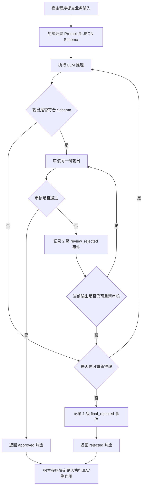

# IntelligentHarness

`IntelligentHarness` 是面向高副作用业务场景的 LLM 输出控制组件。

它位于大模型与宿主程序之间，不直接执行发布、审批、发送或提交等真实业务动作，而是对模型输出进行结构校验、重复审核、有界重新推理、稳定拒绝和业务事件留痕，最终向宿主程序返回统一响应结构体。

```text
业务输入 -> IntelligentHarness -> 结构化审核结果 -> 宿主程序决定是否执行真实动作
```

## 项目目的

大模型输出具有随机性。Prompt、角色设定和自然语言审核规则只能降低风险，无法形成稳定的硬约束。

在营销文案自动发布、内容安全审核、财务审计、贷款资质判断等场景中，错误输出可能造成合规风险、经济损失或错误决策。此类输出不能在单次模型调用后直接进入外部系统。

本项目解决的问题是：

> 如何在不信任单次 LLM 输出的前提下，为宿主程序提供可配置、可审计、可扩展、能够稳定拒绝不合格输出的控制层？

## 业务价值

`IntelligentHarness` 将大模型从“直接参与业务动作”的不稳定执行者，转化为“输出必须经过控制流程”的候选结果提供者。

它带来的价值包括：

- **降低副作用风险**：审核未通过时不会向宿主程序返回可直接放行的结果。
- **提高结果稳定性**：同一份输出可重复审核，审核持续失败后再重新推理。
- **控制模型调用成本**：审核次数和重新推理次数均有明确上限。
- **支持业务追溯**：每次推理、拦截和最终拒绝均可形成独立业务事件。
- **降低场景切换成本**：Prompt、Schema 和场景绑定资源外置，运营维护人员无需修改核心代码。
- **保留宿主控制权**：组件只返回结构化结果，真实业务动作始终由宿主程序决定。

## 核心能力

| 能力 | 说明 |
|---|---|
| 场景注册表 | 根据配置加载不同业务场景的 Prompt、输入 Schema 和输出 Schema |
| JSON Schema 校验 | 对场景输入和模型输出执行结构约束 |
| 重复审核 | 对同一份模型输出重复审核，降低单次审核随机性带来的误判风险 |
| 有界重新推理 | 审核持续失败后重新生成结果，并限制最大推理次数 |
| 稳定拒绝 | 达到策略上限后返回 `rejected`，而不是无限重试 |
| 统一响应结构 | 始终向宿主程序返回 `HarnessResponse` |
| 双日志体系 | Python 内部日志与业务事件日志相互独立 |
| 告警扩展点 | 业务事件可交给宿主提供的邮件、飞书、Webhook 或监控平台适配器 |
| 故障注入 | 可手写不合规模型输出，验证拦截链路是否正确生效 |

## 业务链路



默认策略：

- 每份输出最多审核 `3` 次，包含首次审核。
- 整个事务最多推理 `3` 次，包含首次推理。
- 每次审核失败都记录 `2` 级业务事件。
- 最终拒绝记录 `1` 级业务事件。

次数可在 `config/harness.yaml` 中调整。

## 响应结构

宿主程序调用 `HarnessWorkflow.execute()` 后获得 `HarnessResponse`：

```python
response = harness.execute(state)

if response.approved:
    host_application.execute_side_effect(response.output)
else:
    host_application.handle_rejection(
        decision=response.decision,
        reasons=response.reasons,
    )
```

`decision` 可能为：

| 值 | 含义 |
|---|---|
| `approved` | 输出通过审核，宿主程序可继续执行自身业务判断 |
| `rejected` | 已达到策略上限，输出被稳定拒绝 |
| `error` | 执行过程中发生系统、适配器、配置或非预期异常 |

即使返回 `approved`，组件也不会自行执行发布、发送、审批或写入宿主业务系统等动作。

## 能力边界

### Harness 负责

- 加载场景资源和运行策略。
- 调用模型执行推理。
- 使用 JSON Schema 校验输入输出结构。
- 对同一份输出执行重复审核。
- 在审核持续失败后执行有限次重新推理。
- 记录内部日志和业务事件。
- 将达到阈值的业务事件交给告警扩展接口。
- 返回统一结构化响应。

### Harness 不负责

- 不负责执行真实业务副作用。
- 不替代领域专家设计 Prompt、Schema 和业务审核规则。
- 不保证 Schema 之外的业务规则天然完备。
- 不内置特定企业的知识库、知识图谱或隐私保护方案。
- 不将 Python 日志级别与业务事件严重级别混为一套机制。

Prompt、Schema 和审核规则的质量仍由场景维护者负责。Harness 保证控制流程稳定执行，不承诺业务规则本身必然正确。

工作流路由、错误分类和事件语义详见 [`docs/workflow-design.md`](docs/workflow-design.md)。

## 预设场景

项目提供四个外置场景资源：

| 场景 | 配置名 | 当前定位 |
|---|---|---|
| 营销文案 | `marketing_copy` | 包含 Prompt、Schema 和确定性禁用表达审核 |
| 内容安全 | `content_safety` | **Demo skeleton**：仅展示资源组织方式，不可直接用于实际业务 |
| 财务审计 | `financial_audit` | **Demo skeleton**：仅展示资源组织方式，不可直接用于实际业务 |
| 贷款资质 | `loan_qualification` | **Demo skeleton**：仅展示资源组织方式，不可直接用于实际业务 |

场景切换不是在代码中硬编码分支，而是通过场景注册表加载对应资源。

除 `marketing_copy` 外，其余场景仅包含最小 Prompt 和 Schema 示例。它们没有经过领域专家评审，也未实现可用于生产环境的领域规则。只有在补充规则、测试和领域验收后，才能宣称支持对应业务场景。

## 可扩展性

RAG、知识图谱和隐私保护并非本项目的待办事项，也不是所有业务场景的必选依赖。

它们与 Harness 解决的问题不同：

- RAG、知识图谱负责补充知识、制度、关系和案例证据。
- 隐私保护负责控制敏感信息进入模型或日志前的处理方式。
- Harness 负责约束模型输出进入高副作用业务链路前的控制流程。

当宿主项目确实需要这些能力时，可通过预留接口按需注入：

| 接口 | 调用时机 | 可接入能力 |
|---|---|---|
| `ContextEnhancer` | 推理前、审核前 | RAG、知识图谱、业务知识库、规则证据 |
| `PrivacyProcessor` | 模型调用前、业务事件落库前 | 脱敏、裁剪、加密封装、日志最小化 |
| `AlertSink` | 业务事件保存后 | 邮件、飞书、Webhook、监控平台 |
| `Inference` | 推理与重新推理阶段 | 自定义模型供应商、离线模型、宿主推理服务 |
| `Reviewer` | 审核阶段 | 规则引擎、模型审核、人工审批桥接 |
| `AuditRepository` | 运行记录与事件保存阶段 | MySQL、PostgreSQL、消息队列或审计平台 |

接口定义位于 `intelligent_harness/ports.py`。默认实现保持轻量，宿主程序按实际需求选择增强能力。

## 日志与业务事件

项目维护两套独立机制：

| 类型 | 用途 | 配置位置 |
|---|---|---|
| Python 内部日志 | 排查程序运行异常和适配器故障 | `config/harness.yaml` 的 `python_logging.level` |
| 业务事件 | 记录节点完成、单次拦截、推理失败、最终拒绝和最终系统错误 | `business_events.alert_severity_threshold` |

业务事件严重级别：

| 级别 | 含义 |
|---|---|
| `3` | 节点完成，仅用于留痕 |
| `2` | 单次审核失败或推理失败，可向外暴露拦截细节 |
| `1` | 最终拒绝或最终系统错误，需要重点关注 |

事件先写入审计存储，再按照阈值交给 `AlertSink`。告警适配器故障不会回滚已经保存的业务事件。

## 运营配置

运营维护人员无需进入 `intelligent_harness/` 修改源码。

| 内容 | 维护位置 | 所需专业程度 |
|---|---|---|
| 默认场景、重试策略、日志级别、告警阈值 | `config/harness.yaml` | 低 |
| Prompt 文案 | `scenarios/<name>/prompts/*.txt` | 低 |
| 输入输出 Schema | `scenarios/<name>/schemas/*.schema.json` | 中高 |
| Prompt 与 Schema 的场景绑定 | `scenarios/<name>/scenario.yaml` | 中 |

YAML 负责运行策略和资源绑定，不承载复杂业务规则。复杂规则属于场景 Schema、Prompt 或宿主审核器的职责。

示例策略：

```yaml
default_scenario: marketing_copy

policy:
  max_review_attempts: 3
  max_inference_attempts: 3

python_logging:
  level: INFO

business_events:
  alert_severity_threshold: 2
```

模型连接和数据库路径通过 `.env` 管理：

```env
MODEL_API_KEY=replace-with-your-api-key
MODEL_BASE_URL=https://api.example.com/v1
MODEL_NAME=deepseek-chat
DB_PATH=data/harness_records.db
```

## 技术栈

| 技术 | 用途 |
|---|---|
| Python 3 | 核心运行环境 |
| LangGraph | 编排推理、审核、重新推理和拒绝状态流转 |
| LangChain OpenAI Adapter | 对接 OpenAI 兼容模型接口 |
| Pydantic | 定义响应结构、状态对象和配置模型 |
| JSON Schema | 对场景输入输出执行结构校验 |
| PyYAML | 加载运行策略和场景资源绑定 |
| SQLite | 默认审计记录与业务事件存储 |
| pytest | 单元测试与故障注入回归测试 |

## 项目结构

```text
intelligent_harness/
  models.py          # 状态、统一响应和审核结果
  ports.py           # 宿主扩展协议
  events.py          # 业务事件和发布策略
  scenarios.py       # 场景资源加载与 Schema 校验
  services.py        # 推理和审核服务
  workflow.py        # 有界重试事务
  assembler.py       # 默认依赖装配
  adapters/          # LLM、SQLite、配置和内部日志
  cli/               # CLI 解析、命令分发和故障注入工具

config/              # 全局策略配置
scenarios/           # 运营维护的场景资源
examples/            # 示例输入
fixtures/            # 故障注入样例
test/                # 自动化测试
cli.py               # 薄 CLI 启动器
```

## CLI

```bash
python cli.py config-validate
python cli.py scenario-list
python cli.py scenario-validate marketing_copy
python cli.py scenario-inspect marketing_copy
python cli.py run --scenario marketing_copy --input examples/marketing_input.json
python cli.py fault-inject --scenario marketing_copy --output fixtures/fault_injection/marketing_copy_rejected.json
```

查看命令说明：

```bash
python cli.py --help
python cli.py fault-inject --help
```

## 故障注入

故障注入用于验证审核策略是否能够正确拦截手写模型输出，不会调用真实模型。

默认样例：

```text
fixtures/fault_injection/marketing_copy_rejected.json
```

执行：

```bash
python cli.py fault-inject \
  --scenario marketing_copy \
  --output fixtures/fault_injection/marketing_copy_rejected.json
```

默认策略下，该样例应产生：

- `9` 次 `review_rejected` 事件。
- `1` 次 `final_rejected` 事件。
- 一个 `decision=rejected` 的结构化响应。

## 测试

```bash
python -m pytest -q
```

提交前执行完整检查：

```bash
python -m ruff format --check .
python -m ruff check .
python -m mypy intelligent_harness
python -m pytest -q
```

## 依赖管理

运行依赖和开发依赖分别记录在 `requirements.in` 与 `requirements-dev.in`。提交的 `requirements.txt` 与 `requirements-dev.txt` 是使用 `pip-tools` 生成的完整锁定文件。

安装开发环境：

```bash
python -m pip install --upgrade pip
python -m pip install -r requirements-dev.txt
```

更新依赖版本后重新生成锁定文件：

```bash
python -m pip install pip-tools
pip-compile --strip-extras requirements.in
pip-compile --strip-extras requirements-dev.in
```

## 当前限制

- 当前默认审计存储为 SQLite，生产环境可通过 `AuditRepository` 替换。
- 当前未接入 LangGraph checkpointer、暂停恢复和人工审批流程。
- 当前未实现宿主业务副作用的幂等控制，因为真实副作用不属于 Harness 职责。
- 除营销文案外，其余预设场景是 demo skeleton，仅用于展示资源切换方式，不可直接用于实际业务。

## License

本项目基于 [MIT License](LICENSE) 发布。
