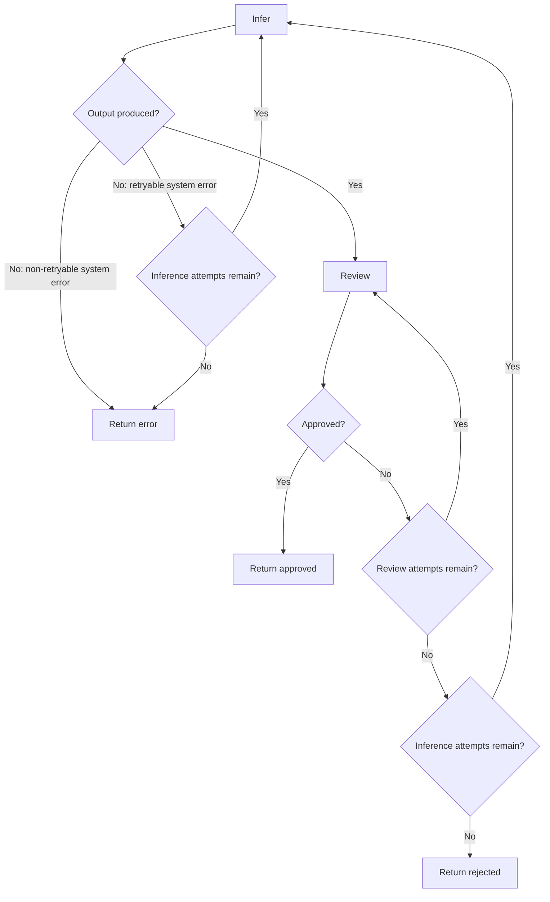

# Workflow Design

`HarnessWorkflow` is a bounded control transaction. It validates and reviews LLM
output before a host application decides whether to perform a real side effect.
The workflow never performs that side effect itself.

## Decision Semantics

| Decision | Meaning |
|---|---|
| `approved` | Output passed review. The host may continue with its own checks. |
| `rejected` | Valid output repeatedly failed business review within policy limits. |
| `error` | A system, adapter, configuration, or unexpected execution failure occurred. |

A system failure must never become `rejected`. Hosts commonly handle a business
rejection and a service outage differently.

## Routing Policy

`intelligent_harness.errors.classify_inference_error()` keeps SDK-specific
exceptions outside the graph. Standard connection and timeout failures, plus
known SDK exception names, are retryable. Other inference failures are
non-retryable unless an adapter explicitly raises `RetryableInferenceError`.

## Events

Each failed inference emits `inference_failed`, and a reviewer exception emits
`review_failed`. A business rejection emits `final_rejected`; a handled system
failure emits `final_error`. Both final event types are severity `1`.
